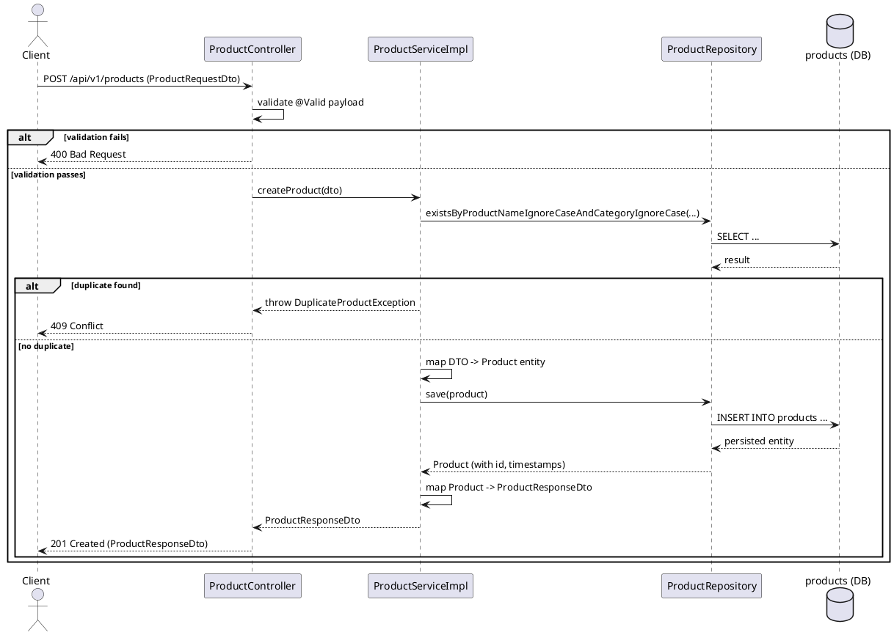
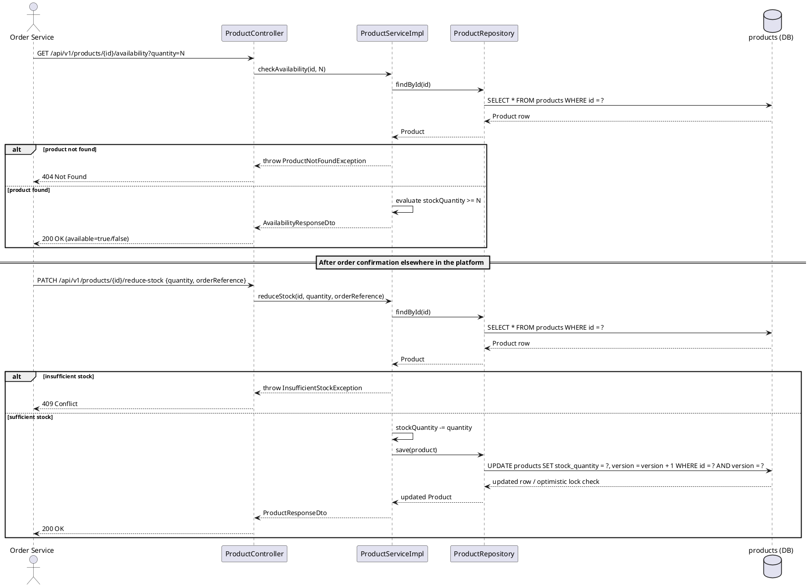
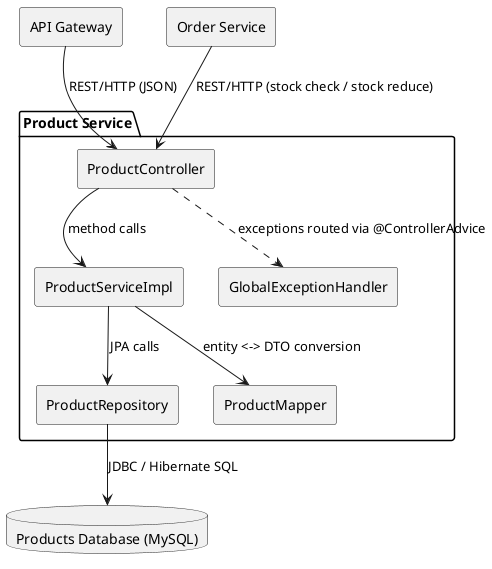
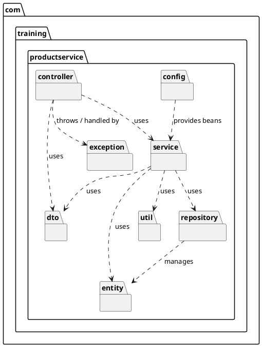
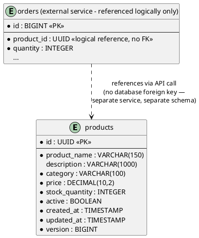

# Product Service Software Design Document

| | |
|---|---|
| **Document Title** | Product Service Software Design Document |
| **System** | Mini E-Commerce Platform |
| **Component** | Product Service (Microservice) |
| **Document Type** | Software Design Document (Pre-Implementation / Design Phase) |
| **Status** | Draft — Design Phase |

---

## 1. Introduction

### 1.1 Purpose

This Software Design Document (SDD) defines the proposed architecture, design, and technical approach for the **Product Service**, a microservice within the Mini E-Commerce Platform. The document is produced **prior to implementation** and serves as the design blueprint that development will follow. It describes the intended package structure, class responsibilities, database schema, REST API contracts, business workflows, and non-functional design goals for the service.

### 1.2 Scope

The Product Service is scoped strictly to **catalog and inventory management** within the Mini E-Commerce Platform. It is one of several independently deployable microservices that together form the platform (for example, an Order Service, a Notification Service, and potentially a User Service, none of which are covered by this document).

This document covers:
- The internal design of the Product Service only.
- The REST API contract exposed by the Product Service to other services and clients.
- The data model owned exclusively by the Product Service.

This document explicitly **excludes**:
- Order placement, order lifecycle, and order history logic (owned by a separate Order Service).
- Notification, messaging, or email/SMS logic (owned by a separate Notification Service).
- Authentication/identity issuance (assumed to be handled by an API Gateway or Identity Service, with the Product Service only enforcing authorization on its own endpoints).
- Payment processing.

### 1.3 Objectives

- Provide a single, authoritative source of truth for product catalog data (name, description, category, price) and inventory data (stock quantity).
- Expose a clean, well-versioned REST API that other services (primarily the Order Service) and front-end clients can consume to read product data and adjust stock.
- Enforce data integrity and validation rules at the API boundary so that invalid product or stock data can never enter the system.
- Establish a layered, testable architecture (Controller → Service → Repository) that is easy to extend as the platform grows.
- Define clear non-functional targets (performance, scalability, reliability, security, maintainability) to guide implementation decisions.
- Keep the service decoupled from other bounded contexts (orders, notifications) so it can be developed, deployed, and scaled independently.

---

## 2. System Overview

The Mini E-Commerce Platform is composed of multiple independently deployable microservices, each owning a distinct bounded context. The **Product Service** owns the **product catalog** and **inventory** bounded context.

Responsibilities of the Product Service:

| Responsibility | Description |
|---|---|
| Add new products | Allow catalog administrators to register new products into the system |
| Update product information | Allow modification of product metadata (name, description, category) |
| Update product prices | Allow price changes independent of other product attributes |
| Manage product stock | Allow stock quantity to be increased, decreased, or set directly |
| Check product availability | Allow callers (primarily the Order Service) to verify sufficient stock exists before an order is placed |
| Reduce stock after a successful order | Decrement stock quantity once an order has been confirmed elsewhere in the platform |
| Retrieve product details | Provide detailed information for a single product by its identifier |
| Retrieve all products | Provide a list/catalog view of all products |

The Product Service does **not**:
- Create, track, or cancel orders.
- Send notifications, emails, or SMS messages.
- Handle payments or invoicing.
- Manage user accounts or authentication credentials.

Other services interact with the Product Service exclusively through its REST API. It does not directly call into the Order Service or Notification Service — any cross-service orchestration (e.g., "reduce stock after order confirmation") is initiated by the calling service (typically the Order Service invoking the Product Service's stock-reduction endpoint), keeping the Product Service a pure, stateless-per-request resource owner.

---

## 3. Functional Requirements

| ID | Requirement | Description |
|---|---|---|
| FR-01 | Add Product | The system shall allow a new product to be created with name, description, category, price, and initial stock quantity. |
| FR-02 | Update Product Information | The system shall allow updating a product's name, description, and category. |
| FR-03 | Update Product Price | The system shall allow updating a product's price independently, without requiring other fields to be resupplied. |
| FR-04 | Manage Product Stock | The system shall allow explicit adjustment of stock quantity (increment/decrement/set), used for restocking or corrections. |
| FR-05 | Check Product Availability | The system shall allow a caller to verify whether a requested quantity of a product is currently available in stock. |
| FR-06 | Reduce Stock After Order | The system shall allow stock quantity to be decremented by a specified amount when notified of a confirmed order, and shall reject the operation if insufficient stock exists. |
| FR-07 | Retrieve Product Details | The system shall allow retrieval of full details for a single product by its unique identifier. |
| FR-08 | Retrieve All Products | The system shall allow retrieval of the complete list of products in the catalog. |
| FR-09 | Delete/Deactivate Product *(supporting requirement)* | The system shall allow a product to be removed from the active catalog (soft delete via a status flag, to preserve referential integrity for historical orders). |

**Out of Scope (explicitly excluded from this service):**
- Order creation, order status tracking, order cancellation.
- Sending order confirmation or shipping notifications.
- User authentication/registration.
- Payment/refund processing.

---

## 4. Non-Functional Requirements

### 4.1 Performance
- Read endpoints (`GET` product details, `GET` all products) should respond within **200 ms** under normal load (P95), backed by indexed database lookups on the primary key and category column.
- Write endpoints (create/update/stock operations) should complete within **300 ms** (P95), including validation and persistence.
- Stock-check and stock-reduction operations must be optimized for low latency since the Order Service will call them synchronously during checkout.

### 4.2 Scalability
- The service is designed to be **stateless** at the application layer, allowing multiple instances to run behind a load balancer and scale horizontally.
- The database is the only stateful component; read scalability can be improved through read replicas or caching (see Section 23) as catalog size and read traffic grow.
- Pagination will be introduced for the "retrieve all products" endpoint to avoid unbounded response sizes as the catalog grows (see Section 23).

### 4.3 Availability
- The service should target **high availability** (e.g., 99.9%) by running multiple stateless instances across availability zones, with no in-memory session state that would tie a client to a specific instance.
- Database connection pooling (via HikariCP, the Spring Boot default) will be configured with sane timeouts to fail fast rather than hold requests indefinitely during downstream slowness.

### 4.4 Reliability
- Stock-reduction operations must be **atomic and consistent**: a decrement must never succeed if it would drive stock below zero. This will be enforced with a conditional update (or optimistic locking via a `@Version` field) at the persistence layer to avoid race conditions under concurrent order requests.
- All write operations occur within a transactional boundary (`@Transactional` at the service layer) to guarantee all-or-nothing persistence.

### 4.5 Security
- All endpoints will be exposed behind an API Gateway; the Product Service itself will validate the presence of a trusted identity/role assertion (e.g., a JWT forwarded by the gateway) for write operations (create/update/stock/delete).
- Read endpoints (`GET`) may be left publicly accessible for catalog browsing, depending on platform-level API Gateway policy.
- Only users/services with an `ADMIN` or `INVENTORY_MANAGER` role should be authorized to create products, update product data, or perform stock adjustments. The Order Service will be granted a scoped, service-to-service credential authorized only for stock-check and stock-reduction operations, not for arbitrary product edits.
- Input validation at the DTO layer (Section 20) mitigates injection and malformed-data risks; use of JPA/Hibernate parameterized queries mitigates SQL injection.

### 4.6 Maintainability
- Strict separation of concerns across Controller, Service, Repository, Entity, and DTO layers (Section 6) so that each layer can be modified independently.
- DTOs decouple the public API contract from the internal persistence model, allowing the entity schema to evolve without breaking API consumers.
- Centralized exception handling (Section 19) keeps error-response formatting consistent and out of individual controller methods.

---

## 5. High-Level Architecture

The Product Service follows a classic **layered (N-tier) architecture** within a single Spring Boot application, deployed as an independent microservice.

```
┌─────────────────────────────────────────────────────────────┐
│                        API Gateway                           │
│         (routing, authentication token validation)           │
└───────────────────────────┬───────────────────────────────────┘
                             │ HTTP/REST (JSON)
                             ▼
┌─────────────────────────────────────────────────────────────┐
│                      PRODUCT SERVICE                         │
│                                                               │
│  ┌───────────────┐   ┌───────────────┐   ┌────────────────┐ │
│  │  Controller    │──▶│    Service     │──▶│  Repository     │ │
│  │  Layer         │   │    Layer       │   │  Layer          │ │
│  │ (REST, DTOs)   │   │ (business      │   │ (Spring Data    │ │
│  │                │   │  logic)        │   │  JPA)           │ │
│  └───────────────┘   └───────────────┘   └────────┬────────┘ │
│                                                     │          │
│  ┌───────────────┐   ┌───────────────┐            │          │
│  │  Exception     │   │  Configuration │            │          │
│  │  Handling      │   │  (config)      │            │          │
│  └───────────────┘   └───────────────┘            │          │
└─────────────────────────────────────────────────────┼──────────┘
                                                        ▼
                                             ┌────────────────────┐
                                             │  Relational          │
                                             │  Database (MySQL)   │
                                             │  `products` table    │
                                             └────────────────────┘

        ▲
        │ REST calls (stock check / stock reduce)
┌───────┴────────┐
│  Order Service  │   (separate microservice, not covered here)
└─────────────────┘
```

Key architectural principles:
- **Single Responsibility per Layer**: Controllers handle HTTP concerns only; Services own business rules; Repositories own persistence.
- **Loose coupling via DTOs**: External API shape (DTOs) is decoupled from internal persistence shape (Entities).
- **Database-per-service**: The Product Service owns its own schema/database exclusively; no other service is permitted direct database access — all access is via the REST API.
- **Statelessness**: No session state is held in the service between requests, enabling horizontal scaling.

---

## 6. Proposed Package Structure

```
com.training.productservice
│
├── controller     → REST controllers exposing HTTP endpoints
├── service         → Business logic interfaces and implementations
├── repository      → Spring Data JPA repository interfaces
├── entity          → JPA entity classes mapped to database tables
├── dto             → Request/response data transfer objects
├── exception       → Custom exceptions and global exception handling
├── config          → Application-level configuration (beans, Swagger, etc.)
└── util            → Cross-cutting helper/utility classes
```

| Package | Responsibility |
|---|---|
| `controller` | Exposes REST endpoints, delegates to the service layer, maps HTTP requests/responses; contains no business logic. |
| `service` | Contains the interfaces and implementation classes that encapsulate all business rules (validation of business invariants, stock arithmetic, availability checks). |
| `repository` | Contains Spring Data JPA repository interfaces providing CRUD and custom query methods against the database. |
| `entity` | Contains JPA-annotated classes representing persistent database tables. |
| `dto` | Contains plain data-carrier classes used to shape request and response payloads, isolating the API contract from the entity model. |
| `exception` | Contains custom exception types (e.g., `ProductNotFoundException`, `InsufficientStockException`) and a `@ControllerAdvice` global exception handler. |
| `config` | Contains Spring `@Configuration` classes (e.g., bean definitions, OpenAPI/Swagger configuration, ModelMapper/MapStruct configuration). |
| `util` | Contains small stateless helper classes (e.g., a mapper utility between entities and DTOs, if not handled by MapStruct). |

---

## 7. Proposed Class Responsibilities

### 7.1 `controller` package

| Class | Responsibility |
|---|---|
| `ProductController` | Exposes all REST endpoints for the Product Service (`POST /products`, `GET /products`, `GET /products/{id}`, `PUT /products/{id}`, `PATCH /products/{id}/price`, `PATCH /products/{id}/stock`, `GET /products/{id}/availability`, `DELETE /products/{id}`). Receives HTTP requests, delegates to `ProductService`, and returns appropriately mapped HTTP responses and status codes. Contains no business logic. |

### 7.2 `service` package

| Class | Responsibility |
|---|---|
| `ProductService` (interface) | Declares the business-facing operations of the Product Service: create, update, updatePrice, adjustStock, checkAvailability, reduceStock, getById, getAll, delete. |
| `ProductServiceImpl` | Implements `ProductService`. Contains the business logic: validates business invariants (e.g., stock cannot go negative), orchestrates repository calls, converts between entities and DTOs, and enforces transactional boundaries via `@Transactional`. |

### 7.3 `repository` package

| Class | Responsibility |
|---|---|
| `ProductRepository` (interface extending `JpaRepository<Product, UUID>`) | Provides CRUD persistence operations for `Product` entities and declarative query methods (e.g., `findByCategory`, `existsByProductNameIgnoreCase`) via Spring Data JPA method-name derivation. |

### 7.4 `entity` package

| Class | Responsibility |
|---|---|
| `Product` | JPA entity mapped to the `products` table. Represents the persistent state of a catalog item: identity, descriptive attributes, price, stock quantity, and audit timestamps. |

### 7.5 `dto` package

| Class | Responsibility |
|---|---|
| `ProductRequestDto` | Carries the payload for creating or fully updating a product (name, description, category, price, stockQuantity). Carries `@Valid` Bean Validation annotations. |
| `ProductResponseDto` | Carries the outbound representation of a product returned to API consumers (id, productName, description, category, price, stockQuantity, createdAt, updatedAt). |
| `PriceUpdateRequestDto` | Carries the payload for updating only a product's price. |
| `StockUpdateRequestDto` | Carries the payload for adjusting stock (quantity delta and operation type, e.g., `INCREASE`/`DECREASE`/`SET`). |
| `StockReductionRequestDto` | Carries the payload sent by the Order Service to reduce stock after a confirmed order (productId implied by path, quantity to reduce, and a reference/order identifier for traceability). |
| `AvailabilityResponseDto` | Carries the response to an availability check (productId, requestedQuantity, available: boolean, currentStock). |

### 7.6 `exception` package

| Class | Responsibility |
|---|---|
| `ProductNotFoundException` | Thrown when a requested product ID does not exist; mapped to HTTP 404. |
| `InsufficientStockException` | Thrown when a stock-reduction or order-availability check cannot be satisfied by current stock; mapped to HTTP 409 (Conflict). |
| `DuplicateProductException` | Thrown when a product creation request violates a uniqueness rule (e.g., duplicate product name within a category); mapped to HTTP 409. |
| `GlobalExceptionHandler` (`@RestControllerAdvice`) | Centralizes translation of exceptions (custom and framework, e.g., `MethodArgumentNotValidException`) into a consistent `ErrorResponseDto` JSON structure and correct HTTP status codes. |

### 7.7 `config` package

| Class | Responsibility |
|---|---|
| `OpenApiConfig` | Configures Swagger/OpenAPI documentation metadata (title, version, description) for the exposed REST API. |
| `ModelMapperConfig` (or MapStruct mapper interfaces) | Provides bean(s) for converting between `Product` entities and DTOs consistently across the service layer. |

### 7.8 `util` package

| Class | Responsibility |
|---|---|
| `ProductMapper` | Stateless utility (or MapStruct-generated implementation) responsible for converting `Product` entities to/from the various DTOs, keeping mapping logic out of the service layer. |

---

## 8. Database Design

### 8.1 `Product` Entity

| Field | Type | Constraints |
|---|---|---|
| `id` | `UUID` | Primary Key, auto-generated (`@GeneratedValue` with a UUID generation strategy, e.g. `@UuidGenerator` / `GenerationType.UUID`) |
| `productName` | `String` | Not null, max length 150 |
| `description` | `String` | Nullable, max length 1000 |
| `category` | `String` | Not null, max length 100 |
| `price` | `BigDecimal` | Not null, precision(10,2), must be ≥ 0 |
| `stockQuantity` | `Integer` | Not null, default 0, must be ≥ 0 |
| `active` | `Boolean` | Not null, default `true` (supports soft delete) |
| `createdAt` | `LocalDateTime` | Not null, set automatically on creation (`@CreatedDate` / `@PrePersist`) |
| `updatedAt` | `LocalDateTime` | Not null, updated automatically on modification (`@LastModifiedDate` / `@PreUpdate`) |
| `version` | `Long` | Optimistic-locking version column (`@Version`), used to safely serialize concurrent stock updates |

**Table**: `products`

**Rationale for design choices:**
- `UUID` is used for `id` rather than a numeric (`Long`/auto-increment) surrogate key so that identifiers are globally unique and non-sequential/non-guessable across services, safe to generate client-side or in a distributed setting without coordinating with the database, and free of the information leakage (e.g., inferring catalog size or creation order) that sequential IDs expose through a public API.
- `BigDecimal` is used for `price` rather than `double`/`float` to avoid floating-point rounding errors in monetary calculations.
- `active` (soft delete flag) is used instead of physical deletion, since historical orders may still reference a product that has since been discontinued.
- `@Version` (optimistic locking) protects `stockQuantity` from lost updates when multiple concurrent requests (e.g., simultaneous checkouts) attempt to reduce stock at the same time.

### 8.2 Relationships

Within the Product Service's own bounded context, there is a **single entity, `Product`**, with no relationships to other entities — the service does not model Orders, Users, or Categories as separate related entities in this design. `category` is modeled as a simple string attribute rather than a foreign-key relationship, keeping the service simple; introducing a normalized `Category` entity is noted as a future enhancement (Section 23).

Logically, the `Product` entity has an **implicit, API-level relationship** to entities owned by other services:
- An **Order** (owned by the Order Service) references one or more `Product` IDs — this relationship is enforced only at the API level (the Order Service calls the Product Service to validate/reduce stock), never via a database foreign key, since each service owns its own database.

### 8.3 Repository Layer

| Method | Purpose |
|---|---|
| `findById(UUID id)` | Inherited from `JpaRepository`; retrieves a single product. |
| `findAll()` | Inherited from `JpaRepository`; retrieves all products (to be replaced with `findAll(Pageable)` once pagination is introduced). |
| `save(Product product)` | Inherited from `JpaRepository`; persists a new or updated product. |
| `deleteById(UUID id)` | Inherited from `JpaRepository`; used only if physical deletion is ever required (soft delete via `active` flag is preferred). |
| `findByCategory(String category)` | Derived query method; supports catalog browsing by category. |
| `existsByProductNameIgnoreCaseAndCategoryIgnoreCase(String name, String category)` | Derived query method; supports duplicate-detection business rule during creation. |
| `findByActiveTrue()` | Derived query method; supports returning only active (non-discontinued) products for standard catalog listing. |

---

## 9. REST API Design

**Base path:** `/api/v1/products`

### 9.1 Create Product

| | |
|---|---|
| **Endpoint** | `/api/v1/products` |
| **Method** | `POST` |
| **Request Body** | `ProductRequestDto` |
| **Response Body** | `ProductResponseDto` |
| **Success Status** | `201 Created` |

**Request Body:**
```json
{
  "productName": "Wireless Mouse",
  "description": "Ergonomic 2.4GHz wireless mouse",
  "category": "Electronics",
  "price": 799.00,
  "stockQuantity": 150
}
```

**Response Body:**
```json
{
  "id": "550e8400-e29b-41d4-a716-446655440000",
  "productName": "Wireless Mouse",
  "description": "Ergonomic 2.4GHz wireless mouse",
  "category": "Electronics",
  "price": 799.00,
  "stockQuantity": 150,
  "createdAt": "2026-07-16T10:15:30",
  "updatedAt": "2026-07-16T10:15:30"
}
```

**Validation Rules:** `productName` not blank (max 150 chars); `category` not blank (max 100 chars); `price` not null, `@DecimalMin("0.0")`; `stockQuantity` not null, `@Min(0)`.

**Error Responses:** `400 Bad Request` (validation failure); `409 Conflict` (`DuplicateProductException` if an identical active product already exists).

---

### 9.2 Get Product by ID

| | |
|---|---|
| **Endpoint** | `/api/v1/products/{id}` |
| **Method** | `GET` |
| **Request Body** | None |
| **Response Body** | `ProductResponseDto` |
| **Success Status** | `200 OK` |

**Validation Rules:** `id` must be a valid `UUID`-formatted path variable.

**Error Responses:** `404 Not Found` (`ProductNotFoundException` if no product with the given ID exists).

---

### 9.3 Get All Products

| | |
|---|---|
| **Endpoint** | `/api/v1/products` |
| **Method** | `GET` |
| **Request Body** | None |
| **Response Body** | `List<ProductResponseDto>` |
| **Success Status** | `200 OK` |

**Validation Rules:** None on this initial design (query parameters for pagination/filtering are a planned enhancement — see Section 23).

**Error Responses:** `500 Internal Server Error` on unexpected persistence failure (handled generically by `GlobalExceptionHandler`).

---

### 9.4 Update Product Information

| | |
|---|---|
| **Endpoint** | `/api/v1/products/{id}` |
| **Method** | `PUT` |
| **Request Body** | `ProductRequestDto` |
| **Response Body** | `ProductResponseDto` |
| **Success Status** | `200 OK` |

**Validation Rules:** Same as Create (Section 9.1); `id` must reference an existing product.

**Error Responses:** `400 Bad Request` (validation failure); `404 Not Found` (product does not exist).

---

### 9.5 Update Product Price

| | |
|---|---|
| **Endpoint** | `/api/v1/products/{id}/price` |
| **Method** | `PATCH` |
| **Request Body** | `PriceUpdateRequestDto` |
| **Response Body** | `ProductResponseDto` |
| **Success Status** | `200 OK` |

**Request Body:**
```json
{ "price": 749.00 }
```

**Validation Rules:** `price` not null, `@DecimalMin("0.0")`.

**Error Responses:** `400 Bad Request` (invalid price); `404 Not Found` (product does not exist).

---

### 9.6 Adjust Stock (Manual/Administrative)

| | |
|---|---|
| **Endpoint** | `/api/v1/products/{id}/stock` |
| **Method** | `PATCH` |
| **Request Body** | `StockUpdateRequestDto` |
| **Response Body** | `ProductResponseDto` |
| **Success Status** | `200 OK` |

**Request Body:**
```json
{ "quantity": 50, "operation": "INCREASE" }
```

**Validation Rules:** `quantity` not null, `@Min(1)`; `operation` not null, restricted to enum values `INCREASE`, `DECREASE`, `SET`.

**Error Responses:** `400 Bad Request` (invalid payload); `404 Not Found` (product does not exist); `409 Conflict` (`InsufficientStockException` if a `DECREASE` would result in negative stock).

---

### 9.7 Check Product Availability

| | |
|---|---|
| **Endpoint** | `/api/v1/products/{id}/availability` |
| **Method** | `GET` |
| **Request Body** | None (query parameter `quantity`) |
| **Response Body** | `AvailabilityResponseDto` |
| **Success Status** | `200 OK` |

**Example:** `GET /api/v1/products/550e8400-e29b-41d4-a716-446655440000/availability?quantity=5`

**Response Body:**
```json
{ "productId": "550e8400-e29b-41d4-a716-446655440000", "requestedQuantity": 5, "available": true, "currentStock": 150 }
```

**Validation Rules:** `quantity` query parameter not null, `@Min(1)`.

**Error Responses:** `400 Bad Request` (missing/invalid quantity); `404 Not Found` (product does not exist).

---

### 9.8 Reduce Stock After Confirmed Order

| | |
|---|---|
| **Endpoint** | `/api/v1/products/{id}/reduce-stock` |
| **Method** | `PATCH` |
| **Request Body** | `StockReductionRequestDto` |
| **Response Body** | `ProductResponseDto` |
| **Success Status** | `200 OK` |

**Request Body:**
```json
{ "quantity": 2, "orderReference": "ORD-98452" }
```

**Validation Rules:** `quantity` not null, `@Min(1)`; `orderReference` not blank (used for traceability/audit logging, not business logic).

**Error Responses:** `400 Bad Request` (invalid payload); `404 Not Found` (product does not exist); `409 Conflict` (`InsufficientStockException` if requested quantity exceeds current stock — the Order Service is expected to treat this as an order-failure signal).

**Note:** This endpoint is intended to be called exclusively by the Order Service (authorized via a scoped service-to-service credential), after an order has already been confirmed, not by end-user clients directly.

---

### 9.9 Delete (Deactivate) Product

| | |
|---|---|
| **Endpoint** | `/api/v1/products/{id}` |
| **Method** | `DELETE` |
| **Request Body** | None |
| **Response Body** | None |
| **Success Status** | `204 No Content` |

**Business Rule:** Performs a **soft delete** by setting `active = false`; the product is excluded from `GET /api/v1/products` results thereafter but remains in the database for historical/audit integrity.

**Error Responses:** `404 Not Found` (product does not exist).

---

### 9.10 Summary Table

| Endpoint | Method | Purpose |
|---|---|---|
| `/api/v1/products` | POST | Add a new product |
| `/api/v1/products` | GET | Retrieve all (active) products |
| `/api/v1/products/{id}` | GET | Retrieve product details |
| `/api/v1/products/{id}` | PUT | Update product information |
| `/api/v1/products/{id}/price` | PATCH | Update product price |
| `/api/v1/products/{id}/stock` | PATCH | Manually adjust stock |
| `/api/v1/products/{id}/availability` | GET | Check stock availability |
| `/api/v1/products/{id}/reduce-stock` | PATCH | Reduce stock after confirmed order |
| `/api/v1/products/{id}` | DELETE | Deactivate (soft delete) a product |

---

## 10. Business Workflow

### 10.1 Adding a Product
1. Client sends `POST /api/v1/products` with a `ProductRequestDto`.
2. `ProductController` performs `@Valid` validation of the payload; invalid input short-circuits to `400 Bad Request` via `GlobalExceptionHandler`.
3. `ProductController` delegates to `ProductServiceImpl.createProduct(dto)`.
4. `ProductServiceImpl` checks for a duplicate active product (same name + category) via `ProductRepository`; if found, throws `DuplicateProductException` → `409 Conflict`.
5. `ProductServiceImpl` maps the DTO to a new `Product` entity (via `ProductMapper`), sets `active = true`, and persists it via `ProductRepository.save()` inside a `@Transactional` boundary.
6. The persisted entity (now containing a generated `id`, `createdAt`, `updatedAt`) is mapped back to a `ProductResponseDto`.
7. `ProductController` returns `201 Created` with the response body and a `Location` header pointing to `/api/v1/products/{id}`.

### 10.2 Updating a Product
1. Client sends `PUT /api/v1/products/{id}` (full update) or `PATCH /api/v1/products/{id}/price` (price only).
2. `ProductController` validates input and delegates to the corresponding `ProductServiceImpl` method.
3. `ProductServiceImpl` retrieves the existing `Product` via `ProductRepository.findById(id)`; if absent, throws `ProductNotFoundException` → `404 Not Found`.
4. The retrieved entity's fields are updated in memory; `updatedAt` is refreshed automatically via `@PreUpdate`.
5. `ProductRepository.save()` persists the change within a transaction; the `@Version` column guards against lost updates from concurrent writers.
6. The updated entity is mapped to a `ProductResponseDto` and returned with `200 OK`.

### 10.3 Checking Stock Availability
1. The Order Service (as caller) sends `GET /api/v1/products/{id}/availability?quantity=N` during checkout, before confirming an order.
2. `ProductController` validates that `quantity` is present and positive.
3. `ProductServiceImpl.checkAvailability(id, quantity)` retrieves the `Product`; if absent, throws `ProductNotFoundException` → `404 Not Found`.
4. The service compares `product.getStockQuantity() >= quantity` and builds an `AvailabilityResponseDto` reflecting the boolean result and current stock — this operation is **read-only** and does not modify stock.
5. `ProductController` returns `200 OK` with the availability result, allowing the Order Service to decide whether to proceed with order confirmation.

### 10.4 Reducing Stock After a Successful Order
1. After the Order Service confirms an order (a step entirely outside this service), it calls `PATCH /api/v1/products/{id}/reduce-stock` with the quantity to deduct and an order reference.
2. `ProductController` validates the payload and delegates to `ProductServiceImpl.reduceStock(id, quantity, orderReference)`.
3. `ProductServiceImpl` retrieves the `Product`; if absent, throws `ProductNotFoundException` → `404 Not Found`.
4. The service re-verifies `product.getStockQuantity() >= quantity` **at the point of the write** (not relying solely on the earlier availability check, since stock may have changed between the two calls); if insufficient, throws `InsufficientStockException` → `409 Conflict`, signaling the Order Service that the reduction failed.
5. If sufficient, the service decrements `stockQuantity` by the requested amount and persists the change via `ProductRepository.save()` inside a `@Transactional` boundary, relying on the `@Version` optimistic-lock column to detect and reject concurrent conflicting updates (which would surface as an `OptimisticLockException`, translated to `409 Conflict` by the `GlobalExceptionHandler`).
6. The updated `Product` is mapped to a `ProductResponseDto` and returned with `200 OK` to the Order Service.

---

## 11. Sequence Diagrams (PlantUML)

### 11.1 Add Product



### 11.2 Check Availability and Reduce Stock (Order Service Interaction)



---

## 12. Component Diagram (PlantUML)



---

## 13. Package Diagram (PlantUML)



---

## 14. Class Diagram (PlantUML)

```plantuml
@startuml
class ProductController {
  - productService : ProductService
  + createProduct(dto: ProductRequestDto) : ResponseEntity<ProductResponseDto>
  + getProductById(id: UUID) : ResponseEntity<ProductResponseDto>
  + getAllProducts() : ResponseEntity<List<ProductResponseDto>>
  + updateProduct(id: UUID, dto: ProductRequestDto) : ResponseEntity<ProductResponseDto>
  + updatePrice(id: UUID, dto: PriceUpdateRequestDto) : ResponseEntity<ProductResponseDto>
  + updateStock(id: UUID, dto: StockUpdateRequestDto) : ResponseEntity<ProductResponseDto>
  + checkAvailability(id: UUID, quantity: Integer) : ResponseEntity<AvailabilityResponseDto>
  + reduceStock(id: UUID, dto: StockReductionRequestDto) : ResponseEntity<ProductResponseDto>
  + deleteProduct(id: UUID) : ResponseEntity<Void>
}

interface ProductService {
  + createProduct(dto: ProductRequestDto) : ProductResponseDto
  + getProductById(id: UUID) : ProductResponseDto
  + getAllProducts() : List<ProductResponseDto>
  + updateProduct(id: UUID, dto: ProductRequestDto) : ProductResponseDto
  + updatePrice(id: UUID, dto: PriceUpdateRequestDto) : ProductResponseDto
  + updateStock(id: UUID, dto: StockUpdateRequestDto) : ProductResponseDto
  + checkAvailability(id: UUID, quantity: Integer) : AvailabilityResponseDto
  + reduceStock(id: UUID, quantity: Integer, orderReference: String) : ProductResponseDto
  + deleteProduct(id: UUID) : void
}

class ProductServiceImpl {
  - productRepository : ProductRepository
  - productMapper : ProductMapper
  ' implements all ProductService methods
}

interface ProductRepository {
  + findByCategory(category: String) : List<Product>
  + findByActiveTrue() : List<Product>
  + existsByProductNameIgnoreCaseAndCategoryIgnoreCase(name: String, category: String) : boolean
}

class Product {
  - id : UUID
  - productName : String
  - description : String
  - category : String
  - price : BigDecimal
  - stockQuantity : Integer
  - active : Boolean
  - createdAt : LocalDateTime
  - updatedAt : LocalDateTime
  - version : Long
}

class ProductRequestDto {
  - productName : String
  - description : String
  - category : String
  - price : BigDecimal
  - stockQuantity : Integer
}

class ProductResponseDto {
  - id : UUID
  - productName : String
  - description : String
  - category : String
  - price : BigDecimal
  - stockQuantity : Integer
  - createdAt : LocalDateTime
  - updatedAt : LocalDateTime
}

class PriceUpdateRequestDto {
  - price : BigDecimal
}

class StockUpdateRequestDto {
  - quantity : Integer
  - operation : StockOperation
}

class StockReductionRequestDto {
  - quantity : Integer
  - orderReference : String
}

class AvailabilityResponseDto {
  - productId : UUID
  - requestedQuantity : Integer
  - available : Boolean
  - currentStock : Integer
}

enum StockOperation {
  INCREASE
  DECREASE
  SET
}

class ProductMapper {
  + toEntity(dto: ProductRequestDto) : Product
  + toResponseDto(entity: Product) : ProductResponseDto
}

class ProductNotFoundException
class InsufficientStockException
class DuplicateProductException

class GlobalExceptionHandler {
  + handleProductNotFound(ex: ProductNotFoundException) : ResponseEntity<ErrorResponseDto>
  + handleInsufficientStock(ex: InsufficientStockException) : ResponseEntity<ErrorResponseDto>
  + handleValidationException(ex: MethodArgumentNotValidException) : ResponseEntity<ErrorResponseDto>
}

class ErrorResponseDto {
  - timestamp : LocalDateTime
  - status : int
  - error : String
  - message : String
  - path : String
}

ProductController --> ProductService
ProductServiceImpl ..|> ProductService
ProductServiceImpl --> ProductRepository
ProductServiceImpl --> ProductMapper
ProductRepository --> Product
ProductMapper --> Product
ProductMapper --> ProductRequestDto
ProductMapper --> ProductResponseDto
StockUpdateRequestDto --> StockOperation
ProductController ..> GlobalExceptionHandler
GlobalExceptionHandler --> ErrorResponseDto
GlobalExceptionHandler ..> ProductNotFoundException
GlobalExceptionHandler ..> InsufficientStockException
GlobalExceptionHandler ..> DuplicateProductException
@enduml
```



---

## 15. Entity Relationship Diagram (PlantUML)

The Product Service's data model consists of a single owned entity. No foreign-key relationships exist within this service's schema; relationships to Orders are logical/API-level only and are shown here for context, not as an enforced database relationship.



---

## 16. Technology Stack

| Layer | Technology |
|---|---|
| Language | Java 17 |
| Framework | Spring Boot |
| Web Layer | Spring Web (Spring MVC, REST controllers) |
| Persistence | Spring Data JPA (Hibernate as the JPA provider) |
| Database | MySQL |
| Build Tool | Maven |
| Boilerplate Reduction | Lombok (`@Getter`/`@Setter`/`@Builder`/`@NoArgsConstructor`/`@AllArgsConstructor` on entities and DTOs) |
| Unit/Integration Testing | JUnit 5 |
| Mocking | Mockito |
| API Documentation | springdoc-openapi (Swagger UI) — proposed for developer-facing API documentation |
| Validation | Jakarta Bean Validation (`spring-boot-starter-validation`) |

---

## 17. Design Patterns

| Pattern | Where Applied | Why It Is Appropriate |
|---|---|---|
| **Controller-Service-Repository (Layered Architecture)** | `ProductController` → `ProductServiceImpl` → `ProductRepository` | Separates HTTP concerns, business rules, and persistence concerns into distinct, independently testable layers — a natural fit for a CRUD-plus-business-rules service like product/inventory management. |
| **Dependency Injection** | Spring-managed beans injected via constructor injection (e.g., `ProductServiceImpl` receiving `ProductRepository` and `ProductMapper`) | Decouples classes from the responsibility of constructing their own collaborators, enabling easy substitution of implementations in unit tests (via Mockito mocks) and adherence to the Dependency Inversion Principle. |
| **Repository Pattern** | `ProductRepository extends JpaRepository<Product, UUID>` | Abstracts persistence/query logic behind an interface, allowing the service layer to work with domain-oriented method calls (`findByCategory`, `findByActiveTrue`) instead of raw SQL/JPQL, and allowing the underlying persistence technology to be swapped with minimal impact on business logic. |
| **DTO (Data Transfer Object) Pattern** | `ProductRequestDto`, `ProductResponseDto`, `PriceUpdateRequestDto`, `StockUpdateRequestDto`, `StockReductionRequestDto`, `AvailabilityResponseDto` | Decouples the public REST contract from the internal `Product` entity/persistence model, so the database schema can evolve (e.g., adding internal audit fields) without breaking API consumers, and prevents over-exposure of internal entity state. |
| **Global Exception Handling (Chain of Responsibility-style centralization via `@RestControllerAdvice`)** | `GlobalExceptionHandler` | Centralizes translation of exceptions into consistent HTTP error responses, removing repetitive try/catch logic from every controller method. |
| **Builder Pattern** | Lombok `@Builder` on `Product` entity and DTOs | Provides a readable, immutable-friendly way to construct entity/DTO instances with multiple optional fields, particularly useful when constructing response DTOs in the mapper. |

---

## 18. SOLID Principles

| Principle | How the Proposed Design Adheres |
|---|---|
| **Single Responsibility Principle (SRP)** | Each class has one reason to change: `ProductController` only changes for HTTP-contract reasons, `ProductServiceImpl` only for business-rule reasons, `ProductRepository` only for query/persistence reasons, and `ProductMapper` only for mapping-shape reasons. |
| **Open/Closed Principle (OCP)** | New stock operations (e.g., a future `RESERVE` operation) can be added by extending the `StockOperation` enum and the corresponding branch in `ProductServiceImpl`, without modifying `ProductController` or `ProductRepository`. New query needs can be added to `ProductRepository` via additional derived methods without touching existing ones. |
| **Liskov Substitution Principle (LSP)** | `ProductServiceImpl` fully implements the `ProductService` interface contract; any future alternative implementation (e.g., a caching decorator) can be substituted wherever `ProductService` is used, without breaking `ProductController`. |
| **Interface Segregation Principle (ISP)** | `ProductService` exposes only the operations relevant to product/inventory management (no order or notification methods leak into this interface), keeping the contract focused and consumer-specific. |
| **Dependency Inversion Principle (DIP)** | `ProductController` depends on the `ProductService` **interface**, not on `ProductServiceImpl` directly; `ProductServiceImpl` depends on the `ProductRepository` **interface**, not on a concrete JDBC/Hibernate implementation. Spring's IoC container wires the concrete implementations at runtime. |

**Strengths of the proposed design:** Clear separation of concerns makes each SOLID principle straightforward to satisfy at this scale.

**Possible improvements once implemented:** Watch for `ProductServiceImpl` growing into a "God class" as more stock-related rules are added — if `updateStock`, `reduceStock`, and `checkAvailability` logic grows complex, consider extracting a dedicated `StockManagementService` collaborator to preserve SRP as the service evolves.

---

## 19. Exception Handling Strategy

- Business-rule violations are represented as **custom checked-by-design runtime exceptions**: `ProductNotFoundException`, `InsufficientStockException`, `DuplicateProductException`.
- A single `GlobalExceptionHandler` annotated with `@RestControllerAdvice` intercepts these exceptions (and framework exceptions such as `MethodArgumentNotValidException` for `@Valid` failures, and `OptimisticLockException` for concurrent-update conflicts) and converts them into a consistent `ErrorResponseDto` JSON structure:

```json
{
  "timestamp": "2026-07-16T10:20:00",
  "status": 404,
  "error": "Not Found",
  "message": "Product with id 999 not found",
  "path": "/api/v1/products/999"
}
```

| Exception | HTTP Status |
|---|---|
| `ProductNotFoundException` | 404 Not Found |
| `DuplicateProductException` | 409 Conflict |
| `InsufficientStockException` | 409 Conflict |
| `MethodArgumentNotValidException` (bean validation failure) | 400 Bad Request |
| `OptimisticLockingFailureException` | 409 Conflict |
| Any unhandled `Exception` | 500 Internal Server Error (generic, non-leaking message) |

- No sensitive internal details (stack traces, SQL, entity internals) are ever included in the response body — only a safe, descriptive message.

---

## 20. Validation Strategy

- **Bean Validation (Jakarta Validation)** annotations are applied directly on DTO fields, not on entities, since validation rules are a property of the *API contract*, not necessarily of every internal persistence state:
  - `@NotBlank` on `productName`, `category`.
  - `@Size(max = ...)` on `productName`, `description`, `category`.
  - `@NotNull` and `@DecimalMin("0.0")` on `price`.
  - `@NotNull` and `@Min(0)` on `stockQuantity` (creation) / `@Min(1)` on `quantity` (stock adjustment and reduction, since a zero-quantity adjustment is meaningless).
  - `@NotNull` on `operation` in `StockUpdateRequestDto`, constrained to the `StockOperation` enum.
- Controllers annotate incoming request bodies with `@Valid` to trigger automatic validation before the request reaches the service layer.
- **Business-level validation** (as opposed to structural/field validation) is performed in `ProductServiceImpl`, not in the controller or via bean validation annotations — e.g., duplicate-product detection, stock-sufficiency checks — since these rules require querying persisted state.
- Path variables (e.g., `id`) are validated implicitly by Spring's type conversion (a non-numeric `id` results in a `400 Bad Request` via `MethodArgumentTypeMismatchException`, also handled by `GlobalExceptionHandler`).

---

## 21. Logging Strategy

- **SLF4J** (via Spring Boot's default logging facade, backed by Logback) will be used throughout the service layer and controller layer.
- **Log levels:**
  - `INFO`: Successful high-level operations (e.g., "Product created with id={}", "Stock reduced for productId={} by quantity={} due to orderReference={}").
  - `WARN`: Recoverable/business-rule rejections (e.g., insufficient stock attempts, duplicate-product attempts) — useful for spotting abnormal caller behavior (e.g., the Order Service retrying against stale availability data).
  - `ERROR`: Unexpected failures caught by the generic handler in `GlobalExceptionHandler`.
  - `DEBUG`: Detailed parameter/flow tracing during development, disabled in production profiles.
- Logs will include **correlation identifiers** (e.g., a request ID or the `orderReference` passed by the Order Service) to make it possible to trace a single order's stock-reduction call through the Product Service's logs.
- No sensitive data is logged (this service has no PII to protect, but price/stock figures are logged only at a level appropriate for operational monitoring, not exposed in client-facing errors).

---

## 22. Security Considerations

- **Transport security:** All traffic is expected to occur over HTTPS, terminated at the API Gateway or load balancer in front of the service.
- **Authentication:** The Product Service does not issue or validate user credentials directly; it trusts a signed identity token (e.g., JWT) forwarded by the API Gateway, and will validate the token's signature/expiry via Spring Security's resource-server support before authorizing write operations.
- **Authorization:** Role-based access control is proposed:
  - `ADMIN` / `INVENTORY_MANAGER` roles required for `POST`, `PUT`, `PATCH .../price`, `PATCH .../stock`, and `DELETE` endpoints.
  - A distinct scoped service credential for the Order Service, authorized only for `GET .../availability` and `PATCH .../reduce-stock`, following the principle of least privilege — the Order Service should never be able to arbitrarily edit product prices or descriptions.
  - `GET` endpoints for catalog browsing may be left unauthenticated, per platform-level policy, since product listings are typically public-facing.
- **Input validation** (Section 20) mitigates malformed/malicious payloads.
- **SQL Injection mitigation:** Achieved inherently through Spring Data JPA/Hibernate's use of parameterized queries; no raw/concatenated SQL is planned anywhere in the design.
- **Rate limiting / abuse protection:** Expected to be enforced at the API Gateway layer, not duplicated inside the Product Service.
- **Sensitive data exposure:** `ErrorResponseDto` messages are designed to avoid leaking stack traces, internal class names, or SQL details to API consumers.

---

## 23. Future Enhancements

| Enhancement | Description |
|---|---|
| **Pagination** | Replace `GET /api/v1/products` returning a full list with `Pageable`-based pagination (`page`, `size`, `sort` query parameters) to handle large catalogs efficiently. |
| **Search** | Add a text-search endpoint (e.g., `GET /api/v1/products/search?keyword=...`) leveraging a database `LIKE`/full-text index or an external search engine for larger catalogs. |
| **Filtering** | Extend `GET /api/v1/products` with query parameters for filtering by `category`, `price` range, and `availability`. |
| **Kafka Integration** | Instead of (or in addition to) the synchronous `reduce-stock` REST call, publish a `StockReducedEvent`/consume an `OrderConfirmedEvent` via Kafka, decoupling the Order Service and Product Service further and improving resilience if the Product Service is briefly unavailable. |
| **Redis Cache** | Cache frequently read, rarely changed data (e.g., product details, category listings) in Redis to reduce database load and improve read latency at scale. |
| **Docker** | Containerize the Product Service with a `Dockerfile` for consistent local development and deployment artifacts. |
| **Kubernetes** | Deploy the containerized service to Kubernetes with a `Deployment` (for horizontal scaling of stateless instances) and a `Service`/`Ingress` for internal/external routing, enabling auto-scaling based on load. |
| **Category as a normalized entity** | Promote `category` from a plain string field to a proper `Category` entity/table if category metadata (e.g., a category hierarchy) becomes necessary. |
| **Audit trail** | Introduce an append-only stock-movement log (separate table) recording every stock change with timestamp, reason, and reference, beyond just the current `stockQuantity` snapshot. |

---

## 24. Assumptions and Limitations

**Assumptions:**
- The API Gateway (not covered by this document) handles initial authentication (issuing/validating the identity token) before requests reach the Product Service.
- The Order Service is solely responsible for order lifecycle logic and will call the Product Service's availability and stock-reduction endpoints synchronously as part of its own checkout workflow; the Product Service does not initiate or track order state.
- A single relational database instance (MySQL) is sufficient for the Product Service's data volume at this stage; no sharding or multi-region replication is assumed in this design.
- `category` is treated as a simple descriptive string rather than a separate normalized entity, since no category-specific behavior (e.g., category-level discounts) has been specified.

**Limitations of this design (to be addressed as the platform matures):**
- No caching layer is included in the initial design; all reads hit the database directly.
- No pagination, filtering, or search is included in the initial `GET /api/v1/products` endpoint.
- No asynchronous/event-driven communication (e.g., Kafka) is included initially; all cross-service communication is synchronous REST, which introduces temporal coupling (the Product Service must be available whenever the Order Service needs a stock check).
- No multi-currency or tax-inclusive pricing model is defined; `price` is a single `BigDecimal` value.
- Concurrency protection for stock updates relies on optimistic locking (`@Version`), which is appropriate for moderate contention but may require revisiting (e.g., pessimistic locking or a queue-based serialization strategy) if very high concurrent order volume against the same product is expected.

---

## 25. Conclusion

This design establishes a focused, single-responsibility **Product Service** that owns product catalog and inventory data exclusively, exposing a well-defined REST API for both catalog management and stock operations. The proposed layered architecture (Controller → Service → Repository), combined with DTO-based API contracts, centralized exception handling, and Bean Validation, provides a solid, maintainable foundation that adheres to SOLID principles and established design patterns appropriate for a microservice of this scope.

By deliberately excluding order management and notification logic, the service remains loosely coupled to the rest of the Mini E-Commerce Platform, communicating only through its REST API. The non-functional design targets (performance, scalability, reliability, security) and the identified future enhancements (pagination, caching, event-driven stock updates, containerization) give a clear, realistic roadmap for evolving the service beyond its initial implementation.

This document should serve as the reference blueprint for the subsequent implementation phase of the Product Service.
